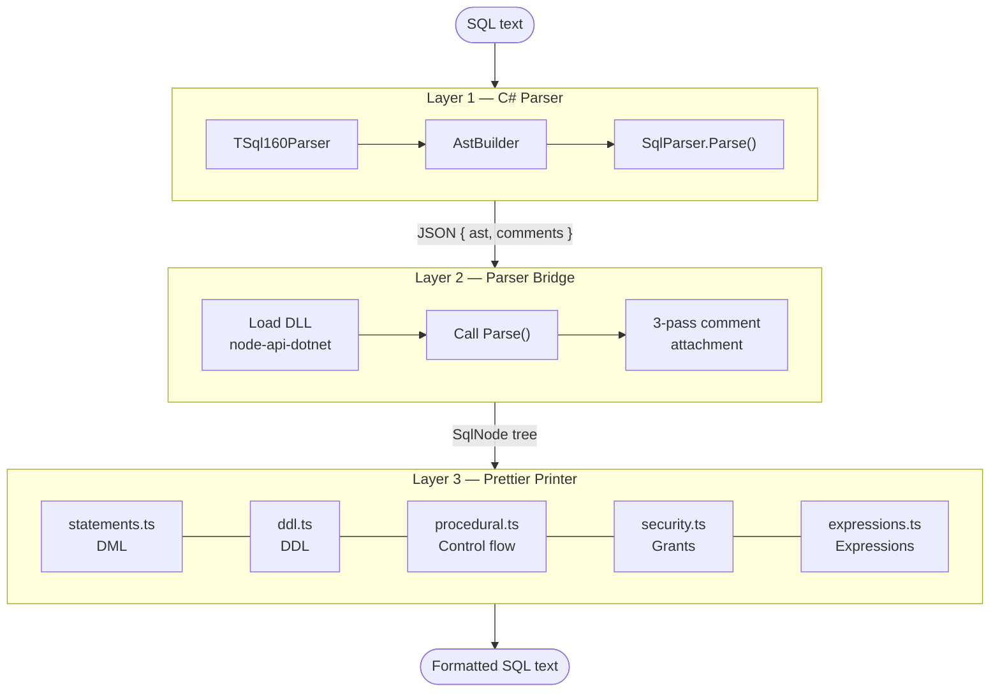

# Architecture

This document describes how `prettier-plugin-tsql` works internally. It is aimed at contributors and anyone curious about the implementation.

---

## Overview

The plugin is a three-layer stack:



---

## Layer 1 — C# Parser (`src/dotnet/SqlScriptDom/`)

### Why C#?

T-SQL is a complex dialect. Rather than maintaining a hand-written parser, the plugin delegates parsing to `Microsoft.SqlServer.TransactSql.ScriptDom` — the same library SQL Server Management Studio and Azure Data Studio use. This means the plugin can parse any valid T-SQL that SQL Server accepts, with accurate error messages.

### Files

| File                  | Purpose                                                                               |
| --------------------- | ------------------------------------------------------------------------------------- |
| `SqlScriptDom.csproj` | .NET 8.0 project; references `Microsoft.SqlServer.TransactSql.ScriptDom` v161.\*      |
| `SqlNode.cs`          | Serializable record: `type`, `startOffset`, `endOffset`, optional `text` and `props`  |
| `AstBuilder.cs`       | `TSqlFragmentVisitor` subclass; walks the ScriptDom tree and builds `SqlNode` objects |
| `SqlParser.cs`        | Static `Parse(string sql)` entry point; extracts comment tokens; returns JSON         |

### Parse flow

1. `TSql160Parser.Parse()` returns a `TSqlFragment` (the full ScriptDom tree) and a list of `ParseError`.
2. If there are errors, the JSON response contains only the errors array.
3. Otherwise, `AstBuilder` visits the fragment using the visitor pattern and builds a simplified `SqlNode` tree. Only the fields the printer needs are included — there are no circular references.
4. Comments are extracted separately from `fragment.ScriptTokenStream` (ScriptDom strips them from the AST). Their byte offsets are computed using a `lineStarts` array built from the source text.
5. The result is serialized as `{ ast: SqlNode, comments: CommentToken[] }`.

### SqlNode structure

```csharp
public record SqlNode(
    string Type,
    int StartOffset,
    int EndOffset,
    string? Text,                         // leaf value (identifier, literal text)
    Dictionary<string, object?>? Props    // named child nodes or arrays of nodes
);
```

`Props` keys use camelCase (matching TypeScript conventions). Values can be:

- A single `SqlNode` child
- A `List<SqlNode>` for ordered collections (e.g., `columns`, `joins`)
- Primitive values (`string`, `bool`) for inline metadata

---

## Layer 2 — Parser Bridge (`src/plugin/parser/`)

### Loading the DLL

`node-api-dotnet` is a native addon that can load .NET assemblies into a Node.js process. Because `node-api-dotnet` is a CommonJS module, it is loaded using `createRequire` from within ESM code:

```ts
const require = createRequire(import.meta.url);
const dotnet = require("node-api-dotnet") as DotnetModule;
dotnet.load("/path/to/SqlScriptDom.dll");
const { SqlParser } = dotnet.PrettierTsql;
```

The DLL path is resolved at runtime by detecting whether the current file is under `dist/parser/` (compiled) or `src/plugin/parser/` (source/ts-node), then walking up to `bin/dotnet/`. The module is cached after a successful `load()` call so the DLL is only initialised once per process.

### Comment attachment

ScriptDom does not attach comments to AST nodes — they exist only in the token stream. The bridge does a three-pass attachment after parsing:

**Pass 1 — Same-line trailing comments**

For each statement (and each VALUES row inside INSERT), look for a `--` line comment on the same source line, after the node ends. If found, it is stored as `node.trailingComment` and emitted via Prettier's `lineSuffix` so it stays on the same output line.

**Pass 2 — Leading and pre-body comments**

Remaining comments are sorted by offset. For each one:

- If it falls **inside** a statement's source span, the comment is checked against the statement's body boundary (`bodyStart`, which `AstBuilder` records as `StatementList.StartOffset` — the offset of the `BEGIN` keyword for procedures and functions, or the body node's own offset for views). If the comment is before that boundary:
  - Comments after the last parameter are stored in `node.postParamComments` (printed between the parameter list and `AS`).
  - Other comments are stored in `node.preBodyComments` (printed before the parameter list — e.g. a banner comment between the procedure name and its parameters).
- Otherwise, the comment is attached as `node.leadingComments` on the first statement that starts at or after the comment's end offset.
- Comments that appear after all statements (end of file) are attached to the last statement's `trailingComment` so they are never silently dropped.

**Pass 3 — Intra-statement comments**

Any comment still inside a statement's span (e.g. a commented-out WHERE predicate) is attached to the nearest surrounding AST descendant. The forward neighbour is preferred — if the next descendant is a statement node (e.g. the first statement inside a `BEGIN`/`END` block), the comment is stored as its `leadingComments`. Otherwise it is appended to the backward neighbour's `trailingComment`.

> **Note:** For simple comparisons like `col = 1`, the parent predicate node and its rightmost scalar child share the same `endOffset`. Pass 3 may therefore land the `trailingComment` on the child (e.g. the literal `1`) rather than the predicate itself. The printer's `rightmostTrailingComment` helper accounts for this by walking into children whose `endOffset` matches the target, so between-predicate comments are emitted correctly regardless of which level they were attached to.

---

## Layer 3 — Prettier Printer (`src/plugin/printer/`)

### Files

| File             | Purpose                                                                                                                                                          |
| ---------------- | ---------------------------------------------------------------------------------------------------------------------------------------------------------------- |
| `index.ts`       | `Printer<SqlNode>` export; `print()` dispatcher by `node.type`; `getVisitorKeys()`                                                                               |
| `statements.ts`  | Script/batch entry points, statement dispatcher, DML (SELECT, INSERT, UPDATE, DELETE, MERGE), OUTPUT clause; exports `printStatementWithComments`                |
| `ddl.ts`         | DDL: CREATE/ALTER TABLE, CREATE/ALTER INDEX, CREATE/ALTER/CREATE OR ALTER PROCEDURE/FUNCTION/VIEW/TRIGGER, CREATE/ALTER SEQUENCE, BULK INSERT, CREATE TYPE, DROP |
| `procedural.ts`  | Transactions, DECLARE, SET variants, USE, WAITFOR, IF/WHILE, EXECUTE, TRUNCATE, control flow, error handling, cursors                                            |
| `security.ts`    | GRANT/DENY/REVOKE, CREATE/ALTER/DROP USER/LOGIN/ROLE                                                                                                             |
| `expressions.ts` | Column references, literals, binary expressions, predicates, function calls, CASE, CAST, JOIN, table references, query expressions                               |
| `helpers.ts`     | Shared `prop()`, `propArr()`, `propStr()`, `propBool()` accessors for the untyped `node.props` record                                                            |
| `utils.ts`       | `keyword()`, `getDensity()`, shared Prettier builder aliases                                                                                                     |

### Printing strategy

The printer uses manual recursion rather than Prettier's path-based traversal. Each `printXxx` function receives a `SqlNode` and returns a Prettier `Doc`. Children are printed by calling helper functions directly.

Prettier's **doc IR** is used to express formatting intent:

| Doc               | Meaning                                                                   |
| ----------------- | ------------------------------------------------------------------------- |
| `hardline`        | Always a newline                                                          |
| `line`            | A newline when the enclosing `group` breaks, otherwise a space            |
| `softline`        | A newline when the enclosing `group` breaks, otherwise nothing            |
| `group([...])`    | Try to fit on one line; if it doesn't fit, switch to break mode           |
| `indent([...])`   | Increase indentation for children                                         |
| `join(sep, docs)` | Interleave a separator between docs                                       |
| `ifBreak(a, b)`   | Emit `a` in break mode, `b` in flat mode                                  |
| `lineSuffix(doc)` | Queue content to the end of the current line (used for trailing comments) |

### Density option

The `sqlDensity` option is threaded through every printer function as part of the Prettier `Options` object. Key differences:

| Construct                       | `compact`                   | `standard`                                    | `spacious`            |
| ------------------------------- | --------------------------- | --------------------------------------------- | --------------------- |
| FROM with joins                 | Inline joins                | Each join on own line                         | Each join on own line |
| Single WHERE predicate          | Inline                      | Inline                                        | Own line              |
| Multiple WHERE predicates       | Wrap at printWidth          | Each on own line                              | Each on own line      |
| Single ON condition             | Inline                      | Inline, wraps if long                         | Own line              |
| Multiple ON conditions          | Wrap at printWidth          | Each on own line                              | Each on own line      |
| SELECT columns                  | Wrap at printWidth          | One per line                                  | One per line          |
| CASE WHEN (single predicate)    | Inline with `when`          | Inline with `when`                            | Own indented line     |
| CASE WHEN (multiple predicates) | Inline, wraps at printWidth | Indented below `when`, `then` at `when` level | Same as standard      |

### GO emission

Batch-isolating statement types are tracked in a `BATCH_ISOLATING` set. After printing each batch, `printScript` emits `go` if the batch contains an isolating statement or if there are multiple batches.

---

## Project Structure

```text
prettier-plugin-tsql/
├── src/
│   ├── dotnet/SqlScriptDom/   # C# parser project
│   │   ├── SqlScriptDom.csproj
│   │   ├── SqlNode.cs
│   │   ├── AstBuilder.cs
│   │   └── SqlParser.cs
│   └── plugin/                # TypeScript Prettier plugin
│       ├── index.ts           # Plugin export
│       ├── language.ts        # .sql / .tsql extension registration
│       ├── options.ts         # sqlKeywordCase, sqlDensity, sqlCommaStyle
│       ├── parser/
│       │   ├── index.ts       # DLL loader, parse(), comment attachment
│       │   └── types.ts       # SqlNode, CommentToken TypeScript interfaces
│       └── printer/
│           ├── index.ts       # Dispatcher + getVisitorKeys
│           ├── statements.ts  # Dispatcher, DML (SELECT/INSERT/UPDATE/DELETE/MERGE)
│           ├── ddl.ts         # DDL statement formatters
│           ├── procedural.ts  # Transactions, control flow, cursors, SET/USE/WAITFOR
│           ├── security.ts    # GRANT/DENY/REVOKE, USER/LOGIN/ROLE
│           ├── expressions.ts # Expression formatters
│           ├── helpers.ts     # Shared prop accessors (prop, propArr, propStr, propBool)
│           └── utils.ts       # keyword(), getDensity(), Prettier builder aliases
├── tests/
│   ├── format.test.ts         # Vitest snapshot tests
│   ├── parser.test.ts         # Parser unit tests
│   └── fixtures/              # Input SQL files by category
├── dist/                      # Compiled JS (generated)
├── bin/dotnet/                # Compiled DLL (generated)
├── package.json
├── tsconfig.json              # ES2022, NodeNext, strict
└── vitest.config.ts
```

---

## Adding Support for a New Statement Type

1. **C# (`AstBuilder.cs`)** — add a `case SomeStatement ss =>` branch in `BuildStatement()` that calls a new `BuildSomeStatement()` method. The builder should return a `SqlNode` with the fields the printer will need.

2. **TypeScript printer** — add a `case 'SomeStatement':` branch in the `printStatement()` switch in `printer/statements.ts`. The `printer/index.ts` dispatcher automatically routes any type whose name ends with `Statement` or equals `BeginEndBlock` to `printStatement()`, so no change to `index.ts` is needed for standard statement types.

3. **Tests** — add a test case in `tests/format.test.ts` using `toMatchSnapshot()`. Run `npm test` to capture the initial snapshot, then review it to confirm the output is correct.

## Adding Support for a New Expression or Table Reference Type

The process is the same as for statements, but targeting different switches:

1. **C# (`AstBuilder.cs`)** — add a case in `BuildScalarExpression()` (for scalar expressions) or `BuildTableReference()` (for table references) and a corresponding builder method. Use `RawText(fragment)` to capture data-type text verbatim (preserving length/precision) rather than navigating the AST for individual identifier parts.

2. **TypeScript printer** — add a `case 'NodeType':` branch in `printExpression()` or `printTableRef()` in `printer/expressions.ts` and the corresponding `printXxx()` function.

3. **ScriptDom property names** — the ScriptDom API sometimes differs from what documentation or examples suggest. If the build fails with `CS1061` ("does not contain a definition for"), use the reflection snippet below to enumerate actual property names:

   ```csharp
   // Run in a small .NET program against the NuGet DLL:
   var dll = Assembly.LoadFrom("path/to/Microsoft.SqlServer.TransactSql.ScriptDom.dll");
   var t = dll.GetType("Microsoft.SqlServer.TransactSql.ScriptDom.TypeName");
   foreach (var p in t?.GetProperties() ?? [])
       Console.WriteLine(p.Name);
   ```

4. **Tests** — add a test case. Use `{ sqlKeywordCase: 'upper' }` on assertion tests that check for keyword strings so the expected string matches the upper-cased output.

---

## Key Dependencies

| Package                                             | Role                          |
| --------------------------------------------------- | ----------------------------- |
| `Microsoft.SqlServer.TransactSql.ScriptDom` (NuGet) | T-SQL parser                  |
| `node-api-dotnet` (npm)                             | Load .NET DLL from Node.js    |
| `prettier` (peer dep)                               | Plugin host and doc IR engine |
| `typescript`                                        | Plugin source language        |
| `vitest`                                            | Test runner                   |
